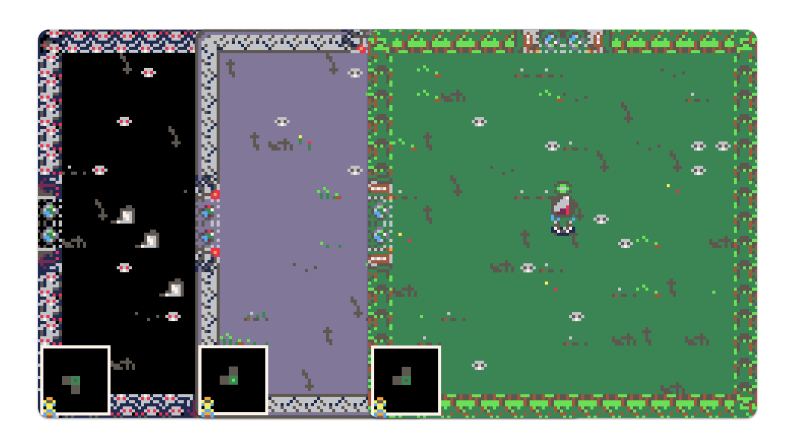

# Apocalypse Couriers \<RE\>

Source code for CS 477 Digital Game Design: PICO-8 Game Project (PGP).

---

## Story and Turn-Based Combat in an 8-bit Package

Apocalypse Couriers is a medieval package-delivering game through the aftermath of Ragnarök, traversing procedurally generated dungeons, engaging in turn-based combat with twisted enemies, and collecting item drops post-combat to aid in your survival as you deliver one package after the other in this horrifying new landscape straight from the depths of hell!

## Synopsis
Apocalypse Couriers is a top-down package-delivery game with a linear storyline, much like Hideo Kojima’s Death Stranding in which you deliver essential packages across a barren, twisted landscape for the entirety of the game; the twist, however, is that you battle medieval enemies that block your path from one merchant to another in randomly generated “dungeon” maps in the middle of the apocalypse, enemies twisted and distorted as hellish versions of themselves become apparent within the game. It’s like hell just merged with earth and humans are the final creatures left alive without any significant altercations.

The procedural generation is be simple and works in similar fashion to The Binding of Isaac’s map generation: one entry point, with randomized rooms surrounding the player, enemy-filled rooms all throughout, and a final room with the merchant's stand within.

Quests are linear, 3 in total equating to 3 total, uniquely-designed floors as you run from one merchant to another, merchants filling you in on the world as you progress, but the dynamic portion and replay-ability that transforms this from a linear RPG like Final Fantasy into a dungeon-crawler like Crypt of the NecroDancer, clearing floor-by-floor of enemies to progress to the next level, is the random floor generation and enemy population each time you travel from one merchant to another.

Most dungeon-crawlers have hack-and-slash mechanics, while Apocalypse Couriers takes the player on a turn-based combat journey through the medieval wasteland, facing off against typical medieval enemies but mangled through the horrors of the waking apocalypse. The player faces-off against these creatures turn-by-turn, going first and choosing their attack. The player has 4 methods of attack, consisting of two light attacks and two heavy attacks, each with their own stats and selectable by their corresponding arrow key.

The player grows stronger based on any power-ups in the forms of “ancient artifacts” that they pick up; health, accuracy, and damage bonuses, reflecting in the respective indicators by the attack itself. These artifacts are either permanent, lasting until the end of the run, or temporary, persisting only within the current floor.

See what awaits in hell-on-earth in this new turn-based, horrifying package-delivery game of doom!
